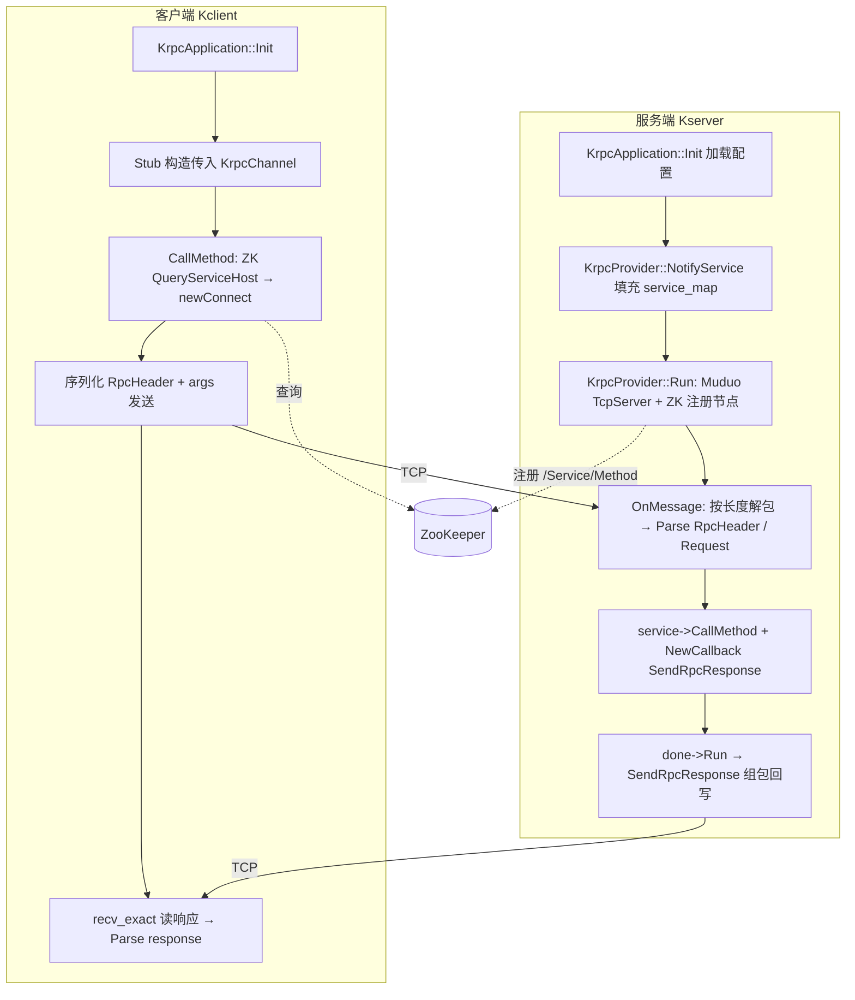

# Krpc 框架学习笔记

> 基于仓库源码整理，面向刚接触 RPC 的 C++ 开发者。

---

## 1. 核心功能概述

**Krpc** 是一个教学向的 **C++ + Protobuf + Muduo + ZooKeeper** 的同步式 RPC 框架，主要能力如下。

| 能力 | 实现要点 |
|------|----------|
| **配置** | 命令行 `-i` 指定配置文件，键值对加载到内存（`rpcserverip/port`、`zookeeperip/port` 等） |
| **服务注册与发现** | 服务端在 ZK 上创建 `/{service}/{method}`，节点数据为 `ip:port`；客户端按路径 `GetData` 解析地址 |
| **网络模型** | 服务端用 **Muduo `TcpServer` + `EventLoop`**（多线程 Reactor），连接与收包在回调里处理 |
| **协议与编解码** | 自定义二进制帧：**总长度 + 头长度 + RpcHeader(Protobuf) + 请求体(Protobuf)**；响应为 **4 字节长度 + Response 序列化数据** |
| **RPC 语义** | 继承 Protobuf 的 `Service` / `RpcChannel` / `RpcController`，Stub 调 `Channel::CallMethod`，服务端 `NotifyService` 注册后用 `Service::CallMethod` 派发到用户实现的 `Login` 等 |
| **粘拆包** | 服务端 `OnMessage` 按 **4 字节大端总长度** 循环 `peek/retrieve`；客户端 `recv_exact` 按长度读满 |

整体链路：

- **服务端**：配置初始化 → 注册服务到内存表 + ZK → 监听 TCP → 解包 → 反序列化 → `CallMethod` → `done->Run()` 回包。
- **客户端**：ZK 查地址 → `connect` → 组包发送 → 按长度收包 → 反序列化。

---

## 2. 关键数据结构

### 2.1 应用与配置

- **`KrpcApplication`**：进程级入口；静态 `Krpcconfig m_config`、懒加载单例指针 + `mutex`（见 `src/include/Krpcapplication.h`）。
- **`Krpcconfig::config_map`**：`std::unordered_map<std::string, std::string>`，存配置文件键值对。

### 2.2 服务侧方法表（`KrpcProvider`）

```cpp
// src/include/Krpcprovider.h（节选）
struct ServiceInfo {
    google::protobuf::Service* service;
    std::unordered_map<std::string, const google::protobuf::MethodDescriptor*> method_map;
};
std::unordered_map<std::string, ServiceInfo> service_map;
```

- 外层 key：**服务名**（来自 `ServiceDescriptor::name()`）。
- **`ServiceInfo`**：具体 `Service*` + **方法名 → `MethodDescriptor*`**，供 `CallMethod` 动态派发。

### 2.3 自定义协议头（Protobuf）

`src/Krpcheader.proto` 中 **`Krpc::RpcHeader`**：`service_name`、`method_name`、`args_size`（与帧里请求体长度一致使用）。

### 2.4 客户端 Channel 状态（`KrpcChannel`）

- `m_clientfd`、`service_name`、`method_name`、`m_ip`、`m_port`、`m_idx`（解析 `ip:port` 字符串时用）。

### 2.5 ZK 封装（`ZkClient`）

- `m_zhandle`：`zhandle_t*`，配合全局 `global_watcher` + `condition_variable` 等待会话连上。

### 2.6 控制器（`Krpccontroller`）

- `m_failed`、`m_errText`，对接 Protobuf `RpcController`；取消相关接口当前未实现。

---

## 3. 执行流程图

### 3.1 启动与一次调用（Mermaid）



### 3.2 协议字节布局

**请求**（`Krpcchannel.cc` 发送与 `Krpcprovider.cc` 解析一致）：

```text
[ uint32 total_len 网络序 ]
[ uint32 header_len 网络序 ]
[ header_len 字节的 RpcHeader 序列化 ]
[ 请求消息 args 的 Protobuf 序列化 ]
```

**响应**：

```text
[ uint32 body_len 网络序 ]
[ LoginResponse 等序列化 ]
```

---

## 4. 设计模式应用

| 模式/思想 | 在 Krpc 中的体现 |
|-----------|------------------|
| **单例（Singleton）** | `KrpcApplication::GetInstance()` + 互斥懒创建；全局读配置，ZK/Muduo 等通过 `GetInstance().GetConfig()` |
| **模板方法 / 框架回调（Protobuf 约定）** | 用户 `UserService` 继承生成的 `UserServiceRpc`，实现 `Login`；框架只认 `google::protobuf::Service` |
| **桥接 / 策略感** | `KrpcChannel` 继承 `google::protobuf::RpcChannel`，把“如何发网络”从 Stub 里拆出去 |
| **Reactor** | Muduo：`setConnectionCallback` / `setMessageCallback`，I/O 与业务在回调链上解耦 |
| **回调（Closure）** | 服务端 `NewCallback(this, &KrpcProvider::SendRpcResponse, conn, response)`，业务 `done->Run()` 时发回包 |
| **RAII** | `KrpcLogger` 构造/析构管理 glog；`Krpcconfig` 中 `unique_ptr<FILE, fclose>` 管理文件 |

---

## 5. 不同模块之间的关联

依赖关系（箭头表示“使用/依赖”）：

- **`KrpcApplication` / `Krpcconfig`**：被几乎所有模块读配置；`Init` 需在 **ZK、Muduo 监听、Channel 首次调用** 之前完成。
- **`KrpcProvider`**：依赖 **`KrpcApplication`（IP/端口）**、**`Krpcheader.pb`（RpcHeader）**、**`ZkClient`（注册）**、**Muduo（网络）**、**Protobuf `Service`（派发）**。
- **`KrpcChannel`**：依赖 **`KrpcApplication`**、**`ZkClient`（发现）**、**`Krpccontroller`（错误上报）**、**`RpcHeader`**、POSIX socket。
- **`ZkClient`**：依赖 **`KrpcApplication::GetConfig()`** 拼 `host:port`；watcher 更新连接状态，`Start()` 中等待连上。
- **`KrpcLogger`**：在示例中与进程绑定；源码中 `LOG` 宏来自 glog。
- **示例 `UserService` / `UserServiceRpc_Stub`**：连接业务 proto 与 Krpc 的 **Provider / Channel** 两端。

**一句话**：配置中心在 `KrpcApplication`；注册发现封装在 `ZkClient`；传输与帧格式在 `KrpcChannel` / `KrpcProvider::OnMessage`；Protobuf 负责 IDL 与消息类型系统。

---

## 6. 常见问题与解决方案

### 6.1 必须先 `KrpcApplication::Init`，且命令行要带 `-i` 配置文件

`Init` 使用 `getopt` 解析 `-i`，参数不对会直接退出。ZK 与服务端监听地址均从配置读取。

### 6.2 ZK 连不上或卡在 `ZkClient::Start()`

`Start()` 会阻塞等待 `global_watcher` 收到 `ZOO_SESSION_EVENT` 且 `ZOO_CONNECTED_STATE`。检查：`zookeeperip`/`zookeeperport`、ZK 进程是否启动、`-DTHREADED` 是否与 `libzookeeper_mt` 一致（根 `CMakeLists.txt` 已定义）。

### 6.3 粘包 / 半包

服务端按 `total_len` 与可读字节比较再 `retrieve`；客户端用 `recv_exact`。若修改协议，**两端对 `total_len` 是否包含 header 的 4 字节等约定必须一致**（当前实现中 `total_len` 为 `4 + header_size + args_size`）。

### 6.4 `controller.Failed()` 为 true

`KrpcChannel::CallMethod` 在连接失败、序列化失败、`send`/`recv` 失败、反序列化失败时会 `SetFailed`。结合 `ErrorText()` 排查网络、ZK 节点是否存在、服务端是否已 `Run`。

### 6.5 `KrpcChannel(true)` 与 `KrpcChannel(false)`

示例使用 **`UserServiceRpc_Stub stub(new KrpcChannel(false))`**：首次 `CallMethod` 才通过 ZK 得到 `m_ip`/`m_port` 并连接。若在尚无地址时使用 `connectNow == true`，构造函数里可能用空的 IP/端口去连接，不符合预期；**延迟连接**更符合当前实现。

### 6.6 并发与 ZK

`QueryServiceHost` 使用全局互斥 `g_data_mutx`；高并发下瓶颈可能在 ZK 与单连接策略。扩展方向可参考 README：连接池、路由缓存、异步等。

### 6.7 Windows 本机编译

工程使用 `unistd.h`、`getopt`、`sys/socket.h`、Muduo、ZooKeeper C API，**CMake 中路径偏 Linux**。在 Windows 上通常需要 WSL/Linux 或替换依赖后再构建。

### 6.8 ZK 节点数据缓冲区

`ZkClient::GetData` 使用固定长度缓冲（如 64 字节）。若 `host:port` 或元数据变长，需注意截断，可改为更大缓冲或动态分配。

---

## 附录：配置文件示例键名

参见 `bin/test.conf`：

- `rpcserverip` / `rpcserverport`：RPC 服务监听地址  
- `zookeeperip` / `zookeeperport`：ZooKeeper 连接地址  
